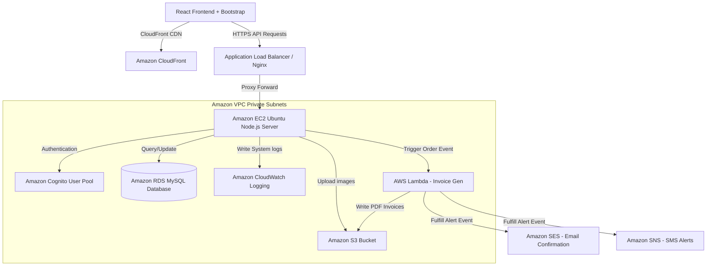

# CloudCart: Cloud-Native E-Commerce Platform

CloudCart is a modern, production-ready, cloud-native e-commerce platform designed as an educational showcase project for final-year MCA Cloud Computing syllabus. The architecture integrates Node.js, React, and MySQL database, configured to demonstrate advanced AWS service deployment workflows.

---

## Architecture Diagram



---

## AWS Services Used

1. **Amazon EC2 (Elastic Compute Cloud)**: Hosts the Express API application inside a secure Ubuntu Linux environment. Utilizes PM2 for zero-downtime execution and Nginx as a reverse proxy/load balancer.
2. **Amazon RDS (Relational Database Service)**: Hosts a multi-AZ MySQL database running CloudCart relational schema for persistent data storage.
3. **Amazon S3 (Simple Storage Service)**: Holds static assets (product photos) uploaded via admins, alongside system invoices generated by serverless tasks.
4. **Amazon CloudFront**: Distributed CDN caching static frontend builds and S3 media keys globally to minimize transaction latencies.
5. **Amazon Cognito**: Provides external customer login pool operations, validating secure JWT access headers without local database storage.
6. **AWS Lambda**: Invoked asynchronously at purchase events to produce PDF transaction invoices inside serverless runtimes.
7. **Amazon SES (Simple Email Service)**: Transmits transactional order details directly to buyer email clients.
8. **Amazon SNS (Simple Notification Service)**: Instantly publishes SMS confirmation text alerts containing invoice totals.
9. **Amazon CloudWatch**: Gathers real-time PM2 system out/err outputs, API exceptions, and query health metrics.

---

## Database Schema Model

The database is built on top of **MySQL**. The relational schema is mapped below:

```
                  +---------------+
                  |     users     |
                  +---------------+
                          | (1)
                          |
                          | (N)
                  +---------------+
                  |    orders     |
                  +---------------+
                   /             \
                  / (1)           \ (1)
                 /                 \
                / (N)               \ (N)
         +-------------+      +--------------+
         | order_items |      |   payments   |
         +-------------+      +--------------+
                \ (N)
                 \
                  \ (1)
         +-------------+      +--------------+
         |  products   |<-----|   reviews    |
         +-------------+ (1)  +--------------+ (N)
                \ (N)
                 \
                  \ (1)
         +-------------+
         | categories  |
         +-------------+
```

### Table Definitions (Summarized from `schema.sql`)
- `users`: Credentials, user role mapping, and Amazon Cognito unique ID references.
- `categories`: Product classifications.
- `products`: Details of merchandise including prices, stock quotas, and S3 media links.
- `cart` & `cart_items`: Real-time shopping basket items sync.
- `orders` & `order_items`: Permanent purchase records showing price-at-sale values.
- `payments`: Transaction IDs, payment modes, and fulfillment statuses.
- `reviews`: Customer ratings (1-5 stars) and feedback comments.

---

## Deployment & Setup Guide

### Local Development (Quickstart via Docker-Compose)

Docker-Compose will build the React frontend and Node API, boot a MySQL container, and auto-initialize the database schema with sample data seeds:

1. Ensure Docker and Docker-Compose are installed.
2. Clone this repository and navigate to the project directory:
   ```bash
   cd cloud-pbl
   ```
3. Boot the environment in detached mode:
   ```bash
   docker-compose up --build -d
   ```
4. Access the platforms:
   - **Frontend UI**: `http://localhost:3000`
   - **Backend API**: `http://localhost:5000`
   - **MySQL Port**: `localhost:3306`

---

### EC2 Ubuntu Manual Deployment Guide

1. **Access Server**: Connect via SSH to your EC2 instance:
   ```bash
   ssh -i your-key.pem ubuntu@ec2-public-ip
   ```
2. **Clone Repo**: Pull the project code:
   ```bash
   git clone https://github.com/yourusername/cloud-pbl.git /var/web/cloudcart
   cd /var/web/cloudcart
   ```
3. **Execute Deploy Script**: Setup permissions and run the script to install Nginx, Node, PM2, build React, and run the server:
   ```bash
   chmod +x aws/scripts/deploy.sh
   ./aws/scripts/deploy.sh
   ```
4. **Environment Variables**: Configure your AWS secrets in `/var/web/cloudcart/backend/.env` and restart PM2:
   ```bash
   pm2 restart cloudcart-api
   ```

---

## Future Enhancements
- Integrate **Amazon ECS (Elastic Container Service)** with Fargate for serverless Docker deployments.
- Build **AWS WAF (Web Application Firewall)** rules to guard against common SQL injections and CSRF attacks.
- Setup **Auto Scaling Groups (ASG)** combined with an **Application Load Balancer (ALB)** for auto-scaling under customer traffic.
# cloudcart
# cloudcart
